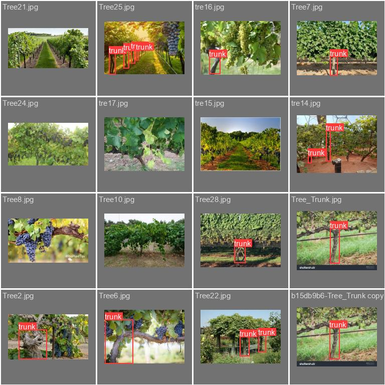
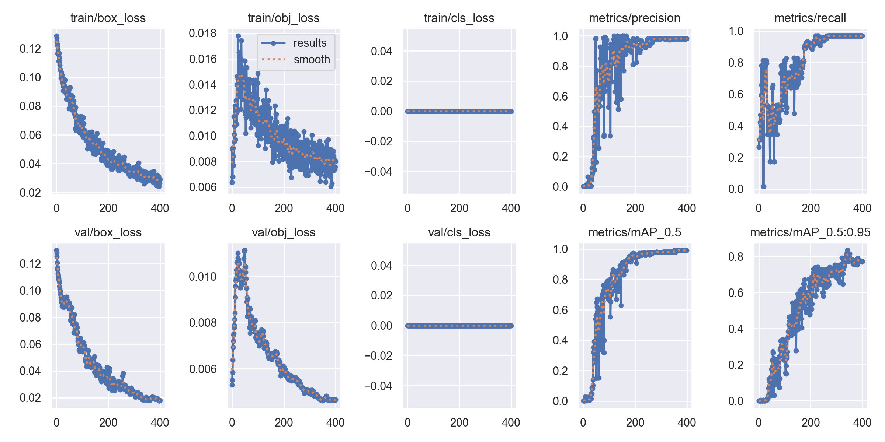

## About project
This project is a trained model made using [YOLO5](https://github.com/ultralytics/yolov5) view [credits](https://github.com/JustANormalThing/ScarletRemiProject#credit) 

This project is about counting grape vine trees.

## Geting started

## How to run the model
```
py -3.12 Camera_YOLO.py
``` 
## Data
||
|---------------------------------------------------------------------------------------|
|Results of validation                                                                                                    |

Here is all the data for and from traing my model

||||
|---------------------------------------------------------------------------------------|
|Results of validation                                                                                                    |
## Credit
This project is made using [YOLO5:](https://github.com/ultralytics/yolov5) all credit to them for making this possible

Jocher, G. (2020). YOLOv5 by Ultralytics (Version 7.0) [Computer software]. https://doi.org/10.5281/zenodo.3908559


This project also used [Lable Studio:](https://github.com/HumanSignal/label-studio) for boundig boxes detection

The name of the project is form Touhou project(https://en.touhouwiki.net/wiki/Remilia_Scarlet)
